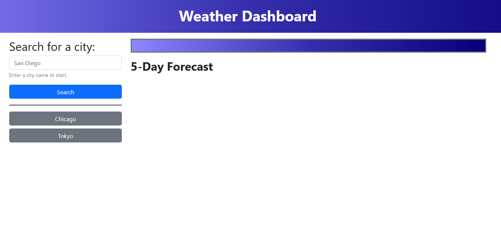
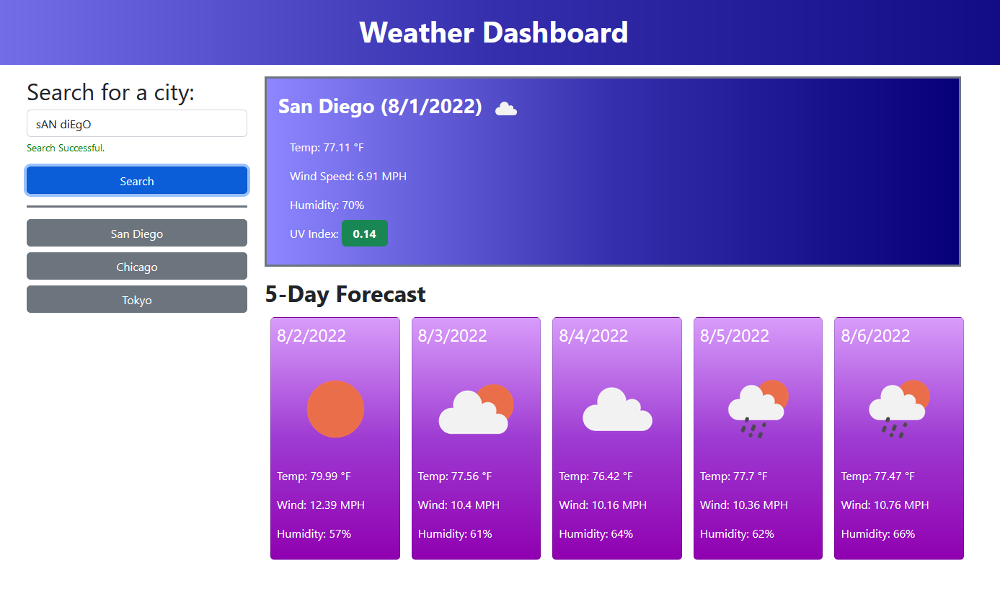
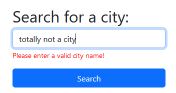

# weather-dashboard

## Description

This project is a weather dashboard for searching for the forecast at any given city that uses OpenWeather API. A user can search any city they want, and get search results for the current weather and 5-day forecast. The search queries are saved in local storage and can be accessed later from buttons in the search history.

## Procedure and Challenges

This project uses Bootstrap CSS for styling. I began with building the look of the website using this framework, allowing the usually non-visible elements be visible for styling purposes. Then, I removed them later as I moved into coding the JavaScript. 

The JavaScript code takes up most of this project. I added functions to retrieve the contents of the search input, and then pass it into a OpenWeather API URL that searches for the searched city's longitude and latitude coordinates. Initially, I had a less robust system of finding coordinates, by hard-coding them in, but after browsing documentation, OpenWeather API seemed to have their own geolocator, thus I utilized that function.

This longitude and latitude was passed as a query into a function that would retrieve the weather data and write it onto the page. This function saves the query to local storage, where it is then rendered into the search history column of the page. The data is then appended onto the page, after the previous search results have been cleared. 

The one problem that would exist with this program is that initially, the search history renders the contents of local storage, in particular the key names. This is so that every reload, the search results persist, but it seems like when someone initially boots up the program, any contents of local storage from anoter github deployment would also persist and be rendered. There is nothing I can do right now about this, as I cannot simply remove local storage on initialization. For now, I can only accept this as a quirk of having everything be deployed on Github.

## Usage Instructions

Upon loading the page, if there are already search results, this means that there are items in local storage. Clear them before use to have the best experience.

You may enter any city into the search bar, and the OpenWeather API will fetch the current weather and 5-day forecast for that location. Searches are NOT case-sensitive, but they must be spelled correctly else you risk searching a different city. Any empty searches or searches that do not correlate with any city in OpenWeather API's geolocator will display a red error below the search bar. Successful searches will display a green success confirmation below the search bar.

Searches are saved to a search history below the search bar. Clicking on any of these will make another request to OpenWeather API to retrieve the weather data of the city again.

## Screenshots

* Weather Dashboard, with some search history

* Successful Search Results 

* Erroneous Search Results

## Credits

Credit to https://flexiple.com/javascript-capitalize-first-letter/ for implementation of capitalizing the first letter of each word in a string.

Credit to https://stackoverflow.com/questions/3138564/looping-through-localstorage-in-html5-and-javascript for implementing looping through local storage.

Credit to https://cssgradient.io/ for easy CSS gradient creation.

## Github Deployed Site Link and Repository Link

GitHub Repository: https://github.com/voravichs/weather-dashboard

GitHub Pages Deployment: https://voravichs.github.io/weather-dashboard/
